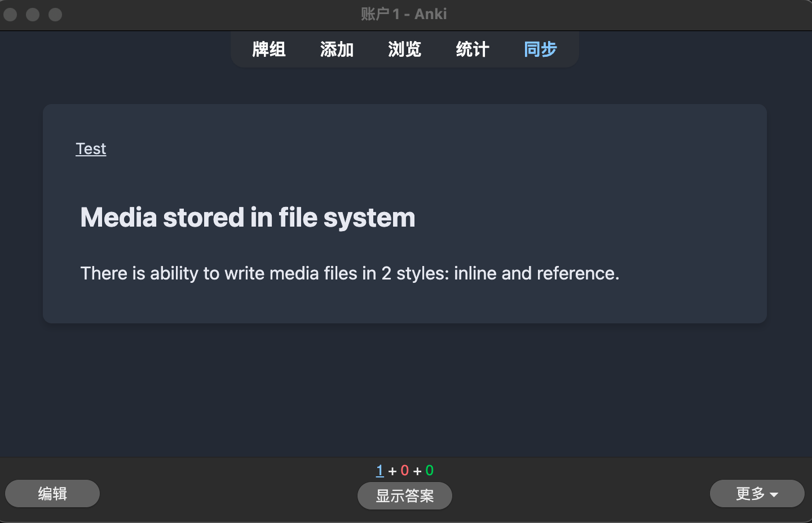
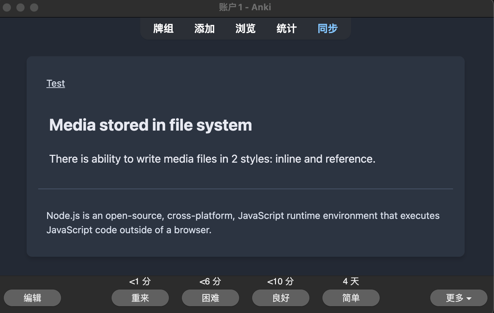
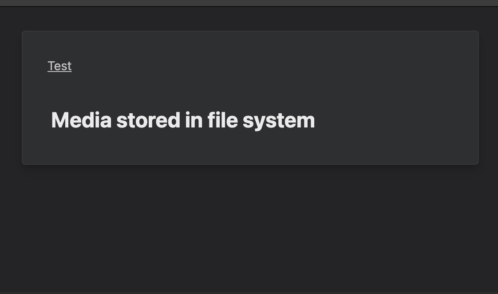
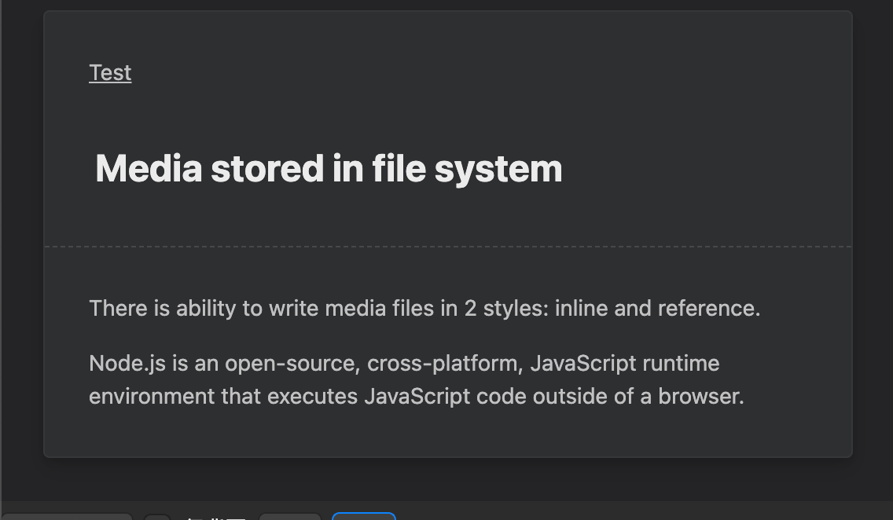
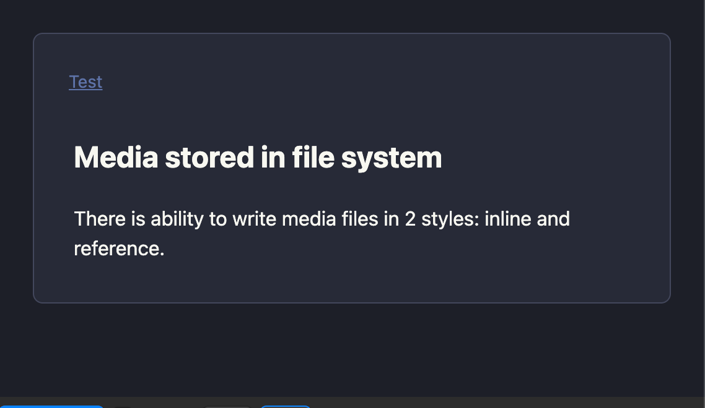
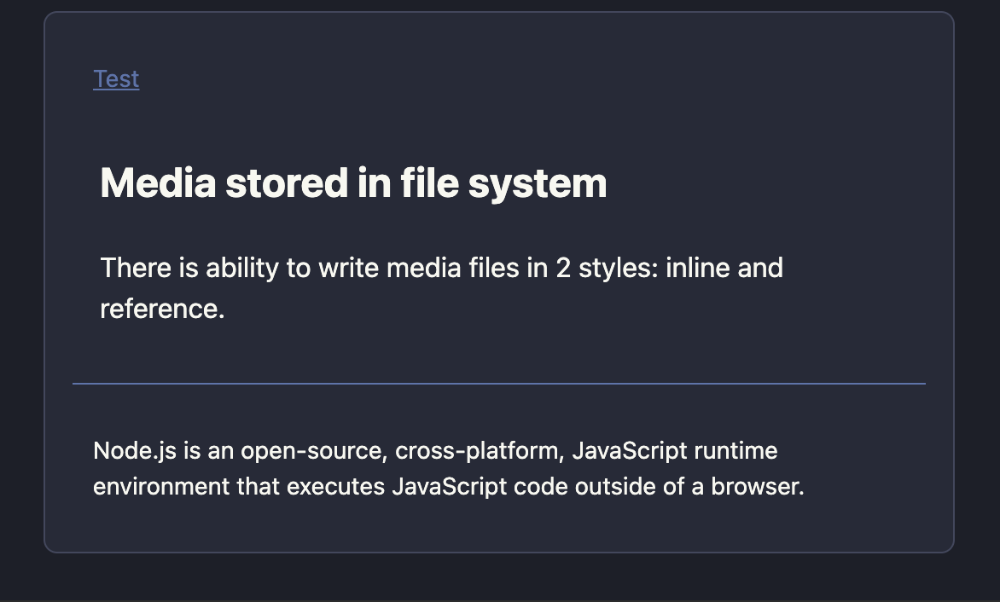
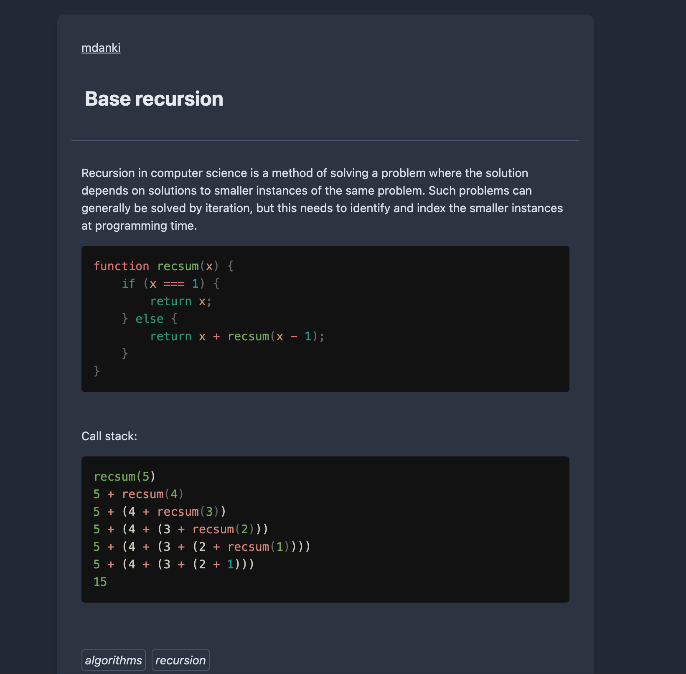

<!-- markdownlint-disable MD033 -->
# md-to-anki

`markdown`转为`anki`卡片

> fork自[mdanki](https://github.com/ashlinchak/mdanki), 结合[anki-prettify](https://github.com/pranavdeshai/anki-prettify)优化卡片样式

## 安装

```bash
npm i -g md-to-anki
```

## 使用

```bash
$ md-to-anki --help

  Usage:
    $ md-to-anki <mdFile>

  Commands:
    <mdFile>  markdown文件

  For more info, run any command with the `--help` flag:
    $ md-to-anki --help

  Options:
    -t, --target <targetFile>  输出的anki文件名 eg: "-d targe.apkg"
    -c, --config <configFile>  配置文件 eg: "-c ./config.json"
    -s, --theme <theme>        样式主题可选 nord/minimal/dracula (default: nord)
    -d, --deckName <deckName>  卡片组名 eg: "-d Test", Default: 取md文件中的"# xx"
    -h, --help                 Display this message
    -v, --version              Display version number
```

## Example

### 默认采用`## xxx..`分割卡片

simple.md

```md
# Test

## Card1
Test

## Card2
Test2

### Card3
Test3
```

```bash
$ md-to-anki ./simple.md -s minimal

> ✔ "Test"含卡片3张: /xxx/simple.apkg
```

### 默认采用 `%` 来分割卡片的正反面

simple.md

```md
# Test

## Media stored in file system

There is ability to write media files in 2 styles: inline and reference.

%

Node.js is an open-source, cross-platform, JavaScript runtime environment that executes JavaScript code outside of a browser.

```

```bash
$ md-to-anki ./simple.md

> ✔ "Test"含卡片1张: /xxx/simple.apkg
```

<div style="display:flex;flex-direction: row;gap:10px">
  <div>
    <p>卡片正面</p>
    
  </div>
  <div>
    <p>卡片反面</p>
    
  </div>
</div>

### 如果没有`%`则，则默认标题为正面其余内容会反面

simple.md

```md
# Test

## Media stored in file system

There is ability to write media files in 2 styles: inline and reference.

Node.js is an open-source, cross-platform, JavaScript runtime environment that executes JavaScript code outside of a browser.

```

```bash
$ md-to-anki ./simple.md -s minimal

> ✔ "Test"含卡片1张: /xxx/simple.apkg
```

<div style="display:flex;flex-direction: row;gap:10px">
  <div>
    <p>卡片正面</p>
    
  </div>
  <div>
    <p>卡片反面</p>
    
  </div>
</div>

### 可通过传入**配置文件**自行定义使用什么符号来分割卡片正反面

config.json

```json
{
  "card": {
    // 卡片分割的正则: ##.. xxx
    "separator": "(?=^#{2,}\\s)",
    // 卡片正反面分割用什么字符串区分 从默认的 % 改为 &&&&
    "frontBackSeparator": "&&&&"
  }
}
```

> ps: 配置文件json**不能带有注释**，上面仅是为了说明

simple.md

```md
# Test

## Media stored in file system

There is ability to write media files in 2 styles: inline and reference.

&&&&

Node.js is an open-source, cross-platform, JavaScript runtime environment that executes JavaScript code outside of a browser.
```

```bash
$ md-to-anki ./simple.md -c ./config.json -s dracula

> ✔ "Test"含卡片1张: /xxx/simple.apkg
```

<div style="display:flex;flex-direction: row;gap:10px">
  <div>
    <p>卡片正面</p>
    
  </div>
  <div>
    <p>卡片反面</p>
    
  </div>
</div>

### 可以含有代码块、图片等资源会一并打包进apkg文件

 

## TODO

- [x] 添加loading
- [x] 更多模板主题选择
